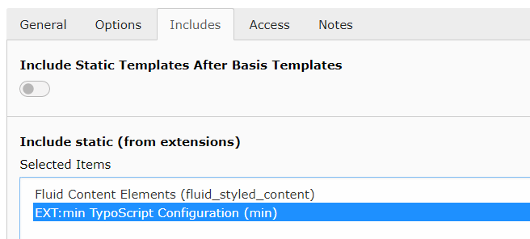

.. include:: Includes.txt

.. _installation:

Installation
============

You can install EXT:min like any other TYPO3 extension.

Requirements
------------

- PHP 8.1 or higher
- TYPO3 12.4

Setup
-----

**Since version 2.0 it is required to manually include the TypoScript configuration, of EXT:min.**

You can do this in TypoScript using the ``@import`` function:

.. code-block:: typoscript

	@import 'EXT:min/Configuration/TypoScript/setup.typoscript'

or define it as static include in the template itself:

Upgrade notice
--------------

When you upgrade EXT:min from version 1.0 to 2.0, **you need to update your TypoScript configuration!**

- The ``protectCode`` moved from ``head`` and ``body`` section, to root level.
  Any old occurrences are being ignored (which may break, protected code)
- The following options has been removed, those functionalities are enabled by default, when tinysource is enabled:
	- ``stripTabs``
	- ``stripNewLines``
	- ``stripDoubleSpaces``
	- ``stripTwoLinesToOne``
- The function ``stripSpacesBetweenTags`` has been removed entirely
